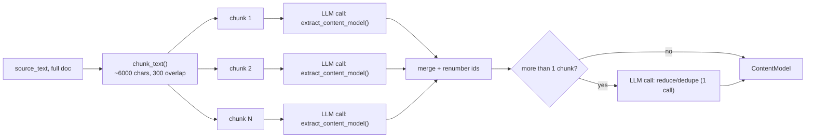

# HLD QBR Generic Pipeline — End-to-End Workflow

This document explains the current (generic, catalog-driven) HLD QBR presentation
pipeline: document extraction, chunking, LLM calls, what is passed to each LLM call,
grounding, content-to-slide decisioning, and PPTX generation.

---

## 1. Document extraction

`app.py` calls `parse_document_with_structure()` from `core/document_parser.py` when a
file is uploaded (txt/docx/pdf/pptx/xlsx). This returns:

- `plain_text` — clean, normalized full text (no truncation at this stage)
- `doc_root` — a detected section/heading tree (used by the *other* templates' semantic
  chunker, not used by HLD QBR)
- `detection_method` — how structure was inferred

This raw `plain_text` becomes `source_text` and flows unmodified into the HLD QBR
branch — nothing is cut here.

---

## 2. Chunking + content extraction (the "map" step)

`extract_content_model_full(key_manager, source_text)` in
`core/content_model_extractor.py` runs **unconditionally**, regardless of requested
slide count:

- Each chunk is sent to the **same open-ended prompt**
  (`llm/prompts_content_model.py`): *"extract a flat list of atomic content items —
  fact, metric, person, quote, process, etc. Do NOT require every category to
  appear."* No topic names, no template awareness at all in this call.
- Each item gets an `id`, `type`, `text`, `attributes` (e.g.
  `{"value": 99.1, "unit": "%"}`), and `source_reference`.
- Results are merged (ids renumbered `C001, C002...`), then — only if there was more
  than one chunk — **one reduce call** removes near-duplicates caused by chunk
  overlap (explicitly forbidden from inventing new items).
- Output: a single `ContentModel` = the complete, deduped inventory of everything in
  the document.

---

## 3. The layout capability catalog (not an LLM call — pre-built, structural)

`templates/build_hld_qbr_layout_catalog.py` was run once offline against the real
`.potx` to produce
`templates/hld_qbr_assets/inventory/layout_capability_catalog.json` — 35 fillable
slides, each described **only by structure**: slot ids, max character counts,
table/chart schemas, repeat-card counts. No slide is labeled "org structure" or
"gemba walk" — just "this slide has a table with 5 columns" or "this slide has a
3-item repeat group."

---

## 4. Outline assignment (LLM call #1 of the planning stage)

`core/presentation_planner_hld_qbr_generic.py` → `_run_outline_stage()`. One call
gets:

| Input | Content |
|---|---|
| Compact catalog | slide_id, has_table/has_chart, repeat-group max counts, slot kinds/maxChars — **no sample text** |
| Full ContentModel | every extracted item (`compact_json()`) |
| Requested slide count | from the UI |
| Always-include ids | cover/agenda/closing (excluded from picking — handled separately) |

The prompt (`llm/prompts_hld_qbr_generic.py`) instructs: *match by structural fit (a
table needs tabular data, a chart needs a numeric series) — never by whether the
document uses the same words as the template.* Output: `{slide_id,
content_item_ids[]}` picks — **this is the "which content becomes slides" decision**,
driven entirely by shape compatibility, not predefined topics.

Code then validates picks against the real catalog, dedupes, truncates to the
requested count, and force-adds the executive summary slide even if the LLM skipped
it.

---

## 5. Content fill (LLM call(s) #2 — batched)

`_run_fill_stage()` batches up to 7 picked slides per call. Each slide in the batch
gets its **full** catalog entry (real slot ids/maxChars/table schema) plus **only its
assigned content items** (never the whole document, never the whole catalog). The
prompt explicitly says sample text is "sizing reference only, never reuse these
names/values as real content" — this directly prevents leftover template sample
names/numbers (e.g. "Nicole Gaudio", "PRIORITY 1") from leaking into generated decks.

---

## 6. Grounding mechanism

- The fill LLM can only write text derived from the `content_item_ids` it was handed
  — it never sees raw source text at this stage.
- `SlideAssignment.content_item_ids` keeps a traceability link per slide.
- `core/governance.py`'s `_check_hld_qbr_generic_governance()` validates after the
  fact: flags any `content_item_ids` that don't exist in the ContentModel, warns if
  distinctive content (a quote, a named person, a risk) was never cited by any slide,
  and trims repeat-items that exceed the catalog's real max count.

---

## 7. PPTX generation

`core/builders/hld_qbr_generic_builder.py` takes the resulting `GenericHLDQBRPlan`
and, for each assigned slide: clones the real template slide (`_clone_slide`, reused
from the old builder), looks up each slot's `shape_id` (stable across the clone) and
sets its text/table/chart data directly — no per-topic dispatch functions, purely
shape-id driven. Cover/agenda/closing are handled as a small structural special case
(title/date/blank breadcrumb; agenda text is the list of chosen slide titles,
computed in code, not by an LLM).

### Known v1 gap

Charts/tables/stat-highlights that don't already exist as native shapes on a slide,
and the old rich executive-summary bullet-cards, aren't wired into this generic path
yet — deferred to a v2 pass. The old render primitives for these
(`_render_stat_highlights`, `_render_process_flow`, chart/kpi_table composition in
`core/builders/hld_qbr_builder.py`) are already generic and reusable when this is
tackled.
