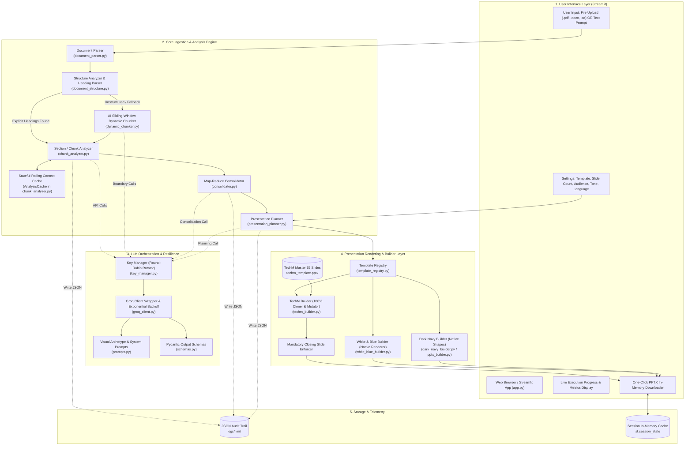
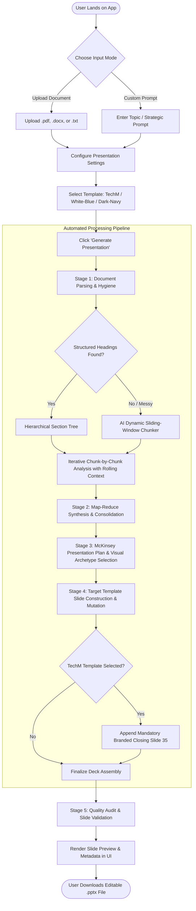
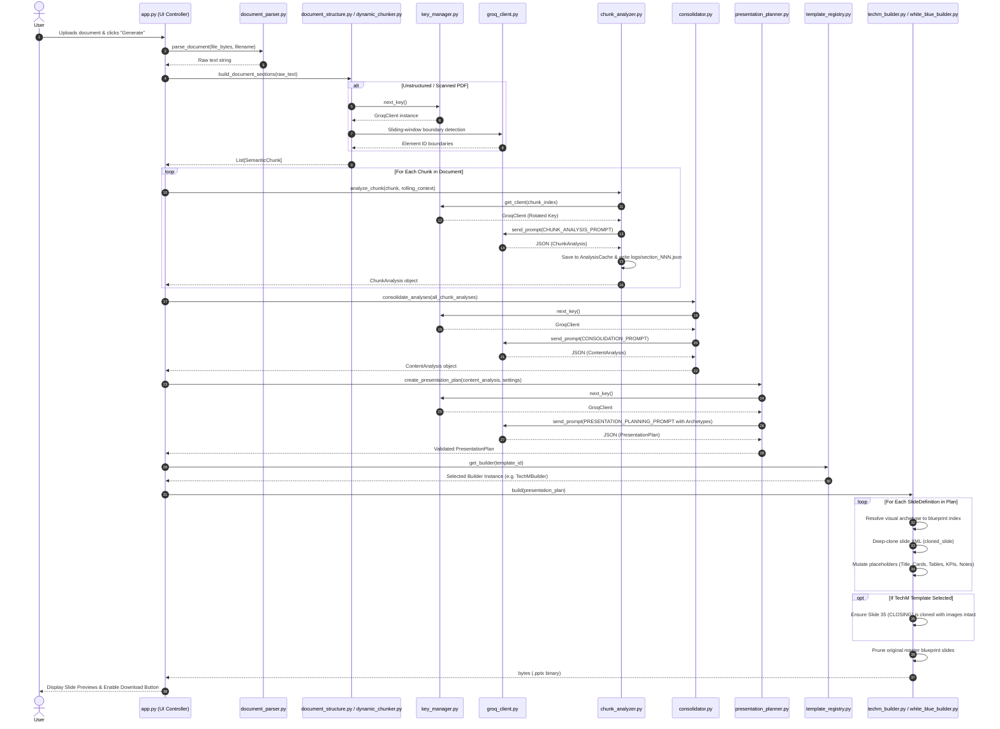

# 🚀 Enterprise AI PowerPoint Presentation Generator
### *Comprehensive Architecture, Technical Specification, Functional Workflows & Implementation Reference*

---

## 📌 1. Executive Summary & Project Overview

### 1.1 Project Mission
The **AI PowerPoint Presentation Generator** is an enterprise-grade automated pipeline that transforms raw, unstructured, or structured input—such as comprehensive whitepapers, enterprise PDF reports, Word documents (`.docx`), plain text files (`.txt`), or open-ended strategic prompts—into visually stunning, fully editable, high-impact PowerPoint (`.pptx`) presentations.

Rather than producing plain, repetitive bullet slides or unformatted text dumps, the system acts as an autonomous McKinsey-level presentation designer:
1. Deconstructs documents into clean semantic trees and logical sections.
2. Analyzes complex content iteratively with rolling context memory.
3. Consolidates overarching narratives, themes, and key data points.
4. Dynamically selects from **Visual Archetypes** (comparison cards, KPI metric grids, multi-column process pillars, data matrices, milestone roadmaps).
5. Renders native, high-fidelity slides utilizing pre-designed corporate templates (including 100% pixel-perfect **Tech Mahindra Corporate** slides, **White & Blue Professional**, and **Dark Navy Executive** styles).

---

### 1.2 Key Milestones & Work Completed

Throughout the project lifecycle, the application has evolved through major architectural paradigms:

| Milestone / Capability | Description & Impact |
|---|---|
| **Dual Ingestion Engine** | Handles both structured/unstructured document uploads (`.pdf`, `.docx`, `.txt`) and free-form interactive prompts. |
| **Dynamic Semantic Chunking Engine** | Intelligently handles messy, unformatted documents lacking headers through an AI-powered sliding-window boundary detector with provenance tracking and element registries. |
| **Stateful Rolling Context Analysis** | Implements an in-memory `AnalysisCache` where each document chunk is analyzed in light of all preceding sections to preserve document-wide narrative coherence. |
| **Map-Reduce Consolidation** | Synthesizes multi-chunk analyses into a single executive `ContentAnalysis` schema, deduplicating facts and identifying data structures. |
| **Universal Visual Archetype Contract** | Liberated slide generation from hardcoded Python heuristics to an **LLM-driven visual selection contract**. The LLM inspects content and freely chooses the optimal visual archetype (`BULLETS`, `CARDS_2_COL`, `CARDS_3_COL`, `STATS`, `TABLE`, `TIMELINE`, etc.). |
| **Multi-Template Architecture & Registry** | Decoupled presentation logic into a pluggable `TemplateRegistry`, supporting distinct builders: `TechMBuilder`, `WhiteBlueBuilder`, and `DarkNavyBuilder`. |
| **100% Fidelity TechM Slide Cloner** | Deep-clones exact slide layouts from the master 35-slide `TechM PowerPoint.pptx` blueprint, preserving corporate vector logos, Aptos typography, and layout geometry, with in-place XML mutation. |
| **Mandatory TechM Closing Slide Guarantee** | Guarantees that presentations generated using the TechM template automatically append the official branded closing slide (Slide 35) with all imagery intact. |
| **Multi-Key Round-Robin API Infrastructure** | Engineered `KeyManager` to distribute LLM requests across a pool of Groq API keys using modulo rotation, completely eliminating `429 Too Many Requests` rate limits. |
| **Pydantic Schema Validation & Resilience** | All LLM outputs are validated against strict Pydantic schemas with automatic exponential backoff, retry loops, and JSON repair fallback. |
| **Persistent JSON Audit Logging** | Every intermediate step (structure inference, chunk analyses, consolidation, presentation plan) is serialized to disk under `logs/llm/<run_id>/` for transparency and debugging. |
| **Input Guardrails** | Validates document and prompt input, masks sensitive identifiers before LLM calls, detects prompt injection, blocks unsafe requests, and rejects operational requests outside presentation generation. |
| **Executive Corporate White & Navy Blue UI** | Modern enterprise interface with top brand navbar, executive deep navy hero banner (`#081E39` to `#0B2545`), gold accent divider (`#FFB800`), crisp white card containers (`#FFFFFF`), bold golden amber action buttons, and in-memory download banner. |

---

## 🛠️ 2. Technology Stack

The application leverages a modern, robust, and lightweight Python ecosystem engineered for speed, reliability, and precision OpenXML manipulation.

```
+---------------------------------------------------------------------------------------+
|                                    TECHNOLOGY STACK                                   |
+---------------------------------------------------------------------------------------+
|  User Interface          |  Streamlit (1.35+) Corporate White & Navy Blue Edition     |
|  Language Runtime        |  Python 3.11+                                              |
|  LLM Inference Engine    |  Groq Cloud API (openai/gpt-oss-120b)                       |
|  Data Validation         |  Pydantic V2 (Strict Schema Enforcement & Type Coercion)   |
|  Document Parsers        |  PyPDF2 (PDF), python-docx (Word), UTF-8 Stream Parser (TXT)|
|  PowerPoint Engine       |  python-pptx (OpenXML manipulation, native shape/table API)|
|  Rate Limiting & Pools   |  Custom Thread-Safe Multi-Key Round-Robin Key Manager      |
|  Configuration & Secrets |  python-dotenv, Pydantic BaseSettings, config.py           |
|  Logging & Telemetry     |  Python logging, JSON Lines / JSON Run Artifacts           |
+---------------------------------------------------------------------------------------+
```

### Detailed Component Inventory

| Category | Component / Library | Purpose & Implementation Details |
|---|---|---|
| **Frontend UI** | `streamlit` | Reactive web interface, session state caching (`st.session_state`), real-time progress callbacks, and dynamic download buttons. |
| **LLM Provider** | `groq` SDK | Ultra-low latency LLM inference powered by Groq LPUs. Default model: `openai/gpt-oss-120b`. |
| **API Load Balancer**| `llm.key_manager.KeyManager` | Thread-safe rotation across multiple Groq API keys (`GROQ_API_KEYS=key1,key2,key3`) to bypass strict per-minute request/token limits. |
| **Schema Validation**| `pydantic` | Enforces structural guarantees on LLM responses (`ChunkAnalysis`, `ContentAnalysis`, `PresentationPlan`, `SlideDefinition`). |
| **Document Processing**| `PyPDF2` & `docx` | Format-agnostic text extraction, paragraph traversal, null-byte sanitization, and whitespace normalization. |
| **PPTX Generation** | `python-pptx` | Programmatic slide creation, deep XML node duplication (`_clone_slide`), table cell population, text frame formatting, and Aptos/Calibri typography styling. |
| **Architecture / Templates** | Custom Builder Pattern | Pluggable builder classes (`TechMBuilder`, `WhiteBlueBuilder`, `DarkNavyBuilder`) registered via `template_registry.py`. |

---

## 🏛️ 3. Architecture Diagrams

### 3.1 High-Level System Architecture



---

### 3.2 Layered Architecture Model

```
+-------------------------------------------------------------------------------------------------+
|                                    1. PRESENTATION LAYER                                        |
|  - Streamlit Dashboard (Dual input: File / Prompt)                                              |
|  - Real-Time Progress Bar & Stage Status Notifications                                          |
|  - Debug Inspector (Chunk Inspection, Structure View, Slide Plan Breakdown)                    |
|  - Direct In-Memory PPTX Download Handler                                                       |
+-------------------------------------------------------------------------------------------------+
                                                |
+-------------------------------------------------------------------------------------------------+
|                                2. ORCHESTRATION & STATE LAYER                                   |
|  - app.py Pipeline Controller (Semantic Pipeline vs. Single-Pass Prompt Pipeline)               |
|  - Streamlit session_state In-Memory Caching (Prevents re-parsing / re-querying on UI toggles)  |
|  - Progress Callback Dispatcher (_progress(step, total, message))                              |
+-------------------------------------------------------------------------------------------------+
                                                |
+-------------------------------------------------------------------------------------------------+
|                                3. PIPELINE & TRANSFORMATION ENGINE                              |
|  - document_parser.py     : Multi-format text extraction (PDF / DOCX / TXT)                     |
|  - document_structure.py  : Hierarchical Section Tree & Regex-based Heading Inferrer            |
|  - dynamic_chunker.py     : Element Registry, Sliding-Window Semantic Boundary Detector        |
|  - chunk_analyzer.py      : Stateful Rolling Context LLM Processor & AnalysisCache              |
|  - consolidator.py        : Map-Reduce Theme Synthesizer & Deduplicator                         |
|  - presentation_planner.py: Universal Visual Archetype Assignment & Slide Plan Generator        |
+-------------------------------------------------------------------------------------------------+
                                                |
+-------------------------------------------------------------------------------------------------+
|                                4. INTELLIGENCE & INFERENCE LAYER                                |
|  - key_manager.py         : Thread-Safe Multi-Key Round-Robin Groq Balancer                     |
|  - groq_client.py         : JSON-mode Enforcer, Error Catcher, Exponential Backoff Retries     |
|  - prompts.py             : Visual Archetypes, Anti-Hallucination & Structural Prompts          |
|  - schemas.py             : Pydantic Data Contracts (ChunkAnalysis, PresentationPlan, etc.)    |
+-------------------------------------------------------------------------------------------------+
                                                |
+-------------------------------------------------------------------------------------------------+
|                                5. TEMPLATE & RENDERING LAYER                                    |
|  - template_registry.py   : Pluggable Template Mapping & Instantiation                         |
|  - techm_builder.py       : Deep Slide Cloning, OpenXML In-Place Mutator, Mandatory Closing      |
|  - white_blue_builder.py  : Clean Corporate Vector Primitives & Geometric Card Containers       |
|  - pptx_builder.py        : Dark Navy Executive Slide Builder & Dynamic Layout Dispatcher       |
+-------------------------------------------------------------------------------------------------+
                                                |
+-------------------------------------------------------------------------------------------------+
|                                6. AUDIT & PERSISTENCE LAYER                                     |
|  - logs/llm/<run_id>/     : Complete Step-by-Step JSON History for Replayability                |
|  - logs/app.log           : Application Diagnostic Logs                                         |
+-------------------------------------------------------------------------------------------------+
```

---

## 🔄 4. Functional Flow (End-to-End User Journey)

### 4.1 Functional Process Map



---

### 4.2 Step-by-Step Functional Journey

1. **Input Submission & Configuration**:
   - The user selects either **Upload Document** or **Enter Prompt**.
   - Parameters configured: Slide Count (Auto or 3–30), Target Audience (General, Business, Technical, Executive), Presentation Style (Professional, Executive, Educational, Technical), Language, and Custom Guidelines.
   - The user selects their corporate design template: **TechM Corporate**, **White & Blue Professional**, or **Dark Navy Executive**.
2. **Text Normalization & Hygiene**:
   - Uploaded files are stripped of null bytes, normalized across unicode character spaces, and validated for size and text readability.
3. **Structure Inference**:
   - The system checks for natural headings (Markdown `#`, numerical `1.1`, underlined text, or PDF font heuristics).
   - If missing, the AI Sliding-Window dynamic chunker groups content into coherent units of thought without cutting paragraphs abruptly.
4. **Context-Aware Information Extraction**:
   - The document is processed chunk by chunk. Each chunk analysis extracts key metrics, facts, quotes, and suggested slide visual archetypes.
   - Previous chunk summaries are continuously carried forward so the LLM retains total document context.
5. **Consolidation**:
   - All chunk analyses are combined into a master strategic overview. Redundancies across sections are eliminated, statistics are normalized, and a coherent narrative structure is formulated.
6. **Visual Archetype Mapping**:
   - Rather than forcing content into generic bullet points, the AI reviews the content and selects the best matching visual archetype:
     - Metrics & Numbers $\rightarrow$ **`STATS`** (Big numerical cards with deltas)
     - Side-by-Side Comparisons $\rightarrow$ **`CARDS_2_COL`** (Split cards with pros/cons or feature lists)
     - Sequential Workflows $\rightarrow$ **`CARDS_3_COL`** or **`PROCESS`** (Stage-by-stage pillars)
     - Dense tabular facts $\rightarrow$ **`TABLE`** (Clean rows and columns)
     - Strategic roadmaps $\rightarrow$ **`TIMELINE`** (Chronological sequence cards)
7. **Deck Generation & Brand Preservation**:
   - The chosen builder instantiates the presentation.
   - If TechM is chosen, original slides are deep-cloned from the master catalog, retaining authentic brand identity, and the official TechM closing slide is attached.
8. **Instant Download & Audit**:
   - The `.pptx` binary is immediately available for download directly from browser memory. Full JSON traces are preserved in `logs/llm/<run_id>/`.

---

## ⚙️ 5. Technical Flow & Data Transformations

### 5.1 Technical Sequence Diagram



---

### 5.2 Deep-Dive: Core Technical Pipeline Stages

#### 1. Ingestion (`document_parser.py`)
- **Format Agnostic**: Inspects MIME types and extensions.
  - `.pdf`: Stream-extracted via `PyPDF2.PdfReader`.
  - `.docx`: Paragraph-traversed via `docx.Document`.
  - `.txt`: Decoded using strict `utf-8` with fallback to `latin-1`.
- **Sanitization**: Strips control characters (`\x00`), normalizes line breaks, and squashes redundant vertical whitespace.

#### 2. Dynamic Semantic Chunking (`dynamic_chunker.py` & `document_structure.py`)
- **Element Registry Pattern**: Every paragraph, list item, or heading is mapped to a unique ordinal element ID (`element_001`, `element_002`, ...).
- **Overlapping Sliding Windows**: Text is evaluated across overlapping element windows (e.g., 20 elements per window with an overlap of 5) so topic transitions occurring at window boundaries are captured.
- **Zero-Loss Assembly**: Boundaries identified by the LLM are stitched together, verified against the element registry to ensure zero dropped sentences, and converted into `List[SemanticChunk]`.

#### 3. Stateful Rolling Context Analysis (`chunk_analyzer.py`)
- **The Problem Solved**: Large enterprise documents quickly overflow single LLM prompt context windows or cause the LLM to forget earlier sections.
- **The Solution**: A stateful `AnalysisCache`. When chunk $N$ is evaluated, the prompt is injected with the executive summary and key takeaways of chunks $1$ through $N-1$.
- **Audit Serialization**: Every single chunk response is serialized to `logs/llm/<run_id>/section_NNN.json`.

#### 4. Map-Reduce Consolidation (`consolidator.py`)
- Takes the array of per-chunk JSON artifacts and issues a consolidation prompt to synthesize overarching themes, detect data structures (comparisons, timelines, KPIs), reconcile conflicting numbers, and compute the optimal slide count.

#### 5. Presentation Planning (`presentation_planner.py`)
- Translates content themes into a concrete, validated `PresentationPlan`.
- Instructs the LLM using the **Universal Visual Archetype Menu** to select distinct layouts matching the cognitive purpose of the information.

#### 6. Multi-Key Round-Robin Balancer (`key_manager.py`)
```python
# Modulo rotation ensures even distribution across API keys:
selected_key = self._keys[chunk_index % len(self._keys)]
```
- Thread-safe key allocation prevents consecutive chunk analyses from hitting the Groq 30-RPM quota.
- Automatic exponential backoff on HTTP `429` (Rate Limit) and `503` (Service Unavailable).

---

## 🎨 6. The Universal Visual Archetype Contract

### 6.1 Why Visual Archetypes?
In earlier versions, layout selection was rigid: the LLM frequently defaulted to standard bullet-point slides (`TITLE_AND_CONTENT`), leaving rich multi-column cards, comparison tables, and KPI metric containers unused. 

We transitioned to a **Visual Archetype Contract**:
- Prompts describe what each archetype **looks like visually**.
- Explicit selection rules instruct the LLM on when to pick cards vs. tables vs. stats.
- Every registered builder implements a 1-to-1 mapping from these archetypes to its own native slides.

### 6.2 Archetype Catalog & Mapping Matrix

| Archetype Name | Visual Layout Description | LLM Selection Rule | TechM Blueprint | White-Blue Layout | Dark-Navy Layout |
|---|---|---|---|---|---|
| **`TITLE`** | Full-screen cover with bold title, subtitle, and branding | Slide 1 cover only. | Slide 06 (Index 5) | `_draw_title` | `_draw_title` |
| **`BULLETS`** | Clean header with 4–6 high-impact action bullets | Narrative text, explanations, key points. | Slide 15 (Index 14) | `_draw_title_content` | `_draw_title_content` |
| **`CARDS_2_COL`**| Two distinct horizontal/vertical comparison cards | Comparing 2 systems, pros vs. cons, before vs. after. | Slide 17 (Index 16) | `_draw_two_column` | `_draw_two_column` |
| **`CARDS_3_COL`**| Three distinct card containers / pillars | 3 pillars, sequential workflow, tri-part architecture. | Slide 18 (Index 17) | `_draw_process` | `_draw_process` |
| **`STATS`** | 3–4 large KPI metric blocks (Big numbers + label + delta)| Quantitative data, benchmarks, growth metrics. | Slide 30 (Index 29) | `_draw_statistics` | `_draw_statistics` |
| **`TABLE`** | 2D structured matrix with distinct header row & grid | Multi-feature comparison, capability matrices. | Slide 29 (Index 28) | `_draw_table` | `_draw_table` |
| **`IMAGE_TEXT`** | Text block adjacent to a visual/image placeholder | Technical architectures, system overviews. | Slide 22 (Index 21) | `_draw_image_text` | `_draw_image_text` |
| **`TIMELINE`** | Chronological milestone flow / badge progression | Historical roadmaps, project phases, award milestones. | Slide 34 (Index 33) | `_draw_timeline` | `_draw_timeline` |
| **`SECTION_HEADER`**| Minimalist divider slide with bold chapter title | Transitions between major agenda topics. | Slide 11 (Index 10) | `_draw_section_header`| `_draw_section_header`|
| **`CONCLUSION`**| Summary takeaways & strategic recommendations | Final slide before closing. | Slide 15 (Index 14) | `_draw_conclusion` | `_draw_conclusion` |
| **`CLOSING`** | Official corporate closing slide with intact imagery | Mandatory brand sign-off. | Slide 35 (Index 34) | Closing Primitive | Closing Primitive |

---

### 6.3 TechM 100% Fidelity Slide Cloning Engine

Unlike standard approaches that construct slides from blank canvases, `TechMBuilder` utilizes a **Direct Slide Cloning & In-Place Mutation** strategy:
1. **Catalog Initialization**: Opens `TechM PowerPoint.pptx` (which contains 35 pre-designed master blueprint slides).
2. **Deep-Clone XML Duplication**: For each slide in the `PresentationPlan`, the exact blueprint slide is deep-cloned into the presentation package using low-level OpenXML replication. This preserves:
   - Official TechM logos and vector assets.
   - Aptos font hierarchies and exact corporate RGB palettes.
   - Pre-styled shapes, drop-shadows, table borders, and card containers.
3. **In-Place Shape Mutation**: Traverses the cloned slide shapes and mutates text frames, table cells, and KPI metrics directly without altering coordinates or geometry.
4. **Mandatory Closing Slide Guarantee**: Automatically clones Slide 35 (Official TechM Closing Slide) to the end of the presentation, keeping pictures, branding, and contact layouts 100% untouched.
5. **Blueprint Pruning**: Deletes the initial 35 blueprint slides from the package, leaving behind only the newly generated, cleanly populated presentation.

---

## 📋 7. Detailed Operational & Setup Instructions

### 7.1 Prerequisites
- **Python 3.11+** installed.
- One or more **Groq API Keys** (Free tier available at [console.groq.com/keys](https://console.groq.com/keys)).
- Operating System: Windows, macOS, or Linux.

---

### 7.2 Installation & Environment Configuration

#### Step 1: Clone the Repository
```bash
git clone <repository_url> ai-ppt-generator
cd ai-ppt-generator
```

#### Step 2: Create & Activate Virtual Environment
```bash
# Windows
python -m venv venv
venv\Scripts\activate

# macOS / Linux
python3 -m venv venv
source venv/bin/activate
```

#### Step 3: Install Required Dependencies
```bash
pip install -r requirements.txt
```

#### Step 4: Configure Environment Variables
Copy `.env.example` to `.env`:
```bash
cp .env.example .env
```

Edit `.env` to configure your API keys and parameters:
```env
# Single key or Comma-separated list of keys for automatic round-robin rotation:
GROQ_API_KEYS=gsk_keyAlpha12345,gsk_keyBeta67890,gsk_keyGamma54321

# Default LLM Model
GROQ_MODEL=openai/gpt-oss-120b
GROQ_TEMPERATURE=0.3
GROQ_MAX_TOKENS=4096
GROQ_MAX_RETRIES=3

# Semantic Chunking Limits
LLM_MAX_CHUNK_CHARS=8000
LLM_MIN_SECTION_CHARS=500

# Presentation Defaults
DEFAULT_TEMPLATE=techm
MAX_SLIDES_LIMIT=30
```

---

### 7.3 Running the Application

Launch the Streamlit dashboard:
```bash
streamlit run app.py
```
Access the application in your browser at:
```
http://localhost:8501
```

---

### 7.4 How to Add a New Template / Builder

The system is designed to be fully extensible via the **Template Registry**:

1. **Create the Builder Class**:
   Add a new builder in `core/builders/my_theme_builder.py`:
   ```python
   from llm.schemas import PresentationPlan

   class MyThemeBuilder:
       def __init__(self, template_path=None):
           self.template_path = template_path

       def build(self, plan: PresentationPlan) -> bytes:
           # Build slides using python-pptx according to plan.slides
           # Return binary pptx bytes
           ...
   ```
2. **Register in `template_registry.py`**:
   Add the new template entry to `_REGISTRY`:
   ```python
   _REGISTRY["my_theme"] = {
       "id": "my_theme",
       "name": "My Custom Corporate Theme",
       "description": "Clean modern theme with custom colors",
       "icon": "🎨",
   }
   ```
3. **Add Dispatch in `get_builder()`**:
   ```python
   if tid == "my_theme":
       from core.builders.my_theme_builder import MyThemeBuilder
       return MyThemeBuilder()
   ```
The new template will automatically appear in the Streamlit UI dropdown selector!

---

### 7.5 Debugging, Inspection & Auditing

Every run generates complete JSON execution traces under `logs/llm/<run_id>/`:
- `document_structure.json` — Breakdown of detected or inferred sections.
- `section_000.json`, `section_001.json`, ... — Exact inputs, summaries, KPIs, and archetypes detected for every chunk.
- `consolidation.json` — Consolidated strategic overview and themes.
- `presentation_plan.json` — Full presentation plan with exact titles, content objects, layout types, and speaker notes.

These logs allow developers to trace any slide or text back to the exact chunk and prompt that produced it.

---

## 🗂️ 8. Complete Project File & Directory Map

```
ai-poc/
│
├── app.py                          # Streamlit application entry point & UI orchestration
├── config.py                       # Global configuration, environment parser & thresholds
├── requirements.txt                # Python package dependencies
├── .env.example                    # Sample environment file template
├── .env                            # Active environment configuration (git-ignored)
├── README.md                       # Quickstart & user documentation
├── PROJECT_DOCUMENTATION.md        # Comprehensive technical & architectural specification (this file)
│
├── core/                           # Core business logic & processing engines
│   ├── document_parser.py          # Format-agnostic text extractor (.pdf, .docx, .txt)
│   ├── document_structure.py       # DocumentSection tree parser & regex heading detector
│   ├── dynamic_chunker.py          # AI sliding-window dynamic chunking engine
│   ├── chunk_analyzer.py           # Stateful chunk analysis & AnalysisCache manager
│   ├── consolidator.py             # Map-Reduce multi-chunk synthesis engine
│   ├── presentation_planner.py     # McKinsey-level slide planner & archetype assigner
│   ├── template_registry.py        # Central pluggable template catalog & builder factory
│   ├── pptx_builder.py             # Dark Navy native presentation builder & layout engine
│   ├── layout_manager.py           # Legacy layout shape matcher & metadata loader
│   ├── slide_generator.py          # Slide content refinement helpers
│   ├── validator.py                # Quality validation & presentation sanity checks
│   │
│   └── builders/                   # Specific Presentation Theme Builders
│       ├── __init__.py             # Builder package exports
│       ├── techm_builder.py        # TechM 100% Fidelity Slide Cloner & Mutator
│       ├── white_blue_builder.py   # White & Blue Professional clean vector builder
│       └── dark_navy_builder.py    # Dark Navy Executive theme builder wrapper
│
├── llm/                            # LLM abstraction, prompts & contracts
│   ├── __init__.py                 # LLM package exports
│   ├── groq_client.py              # Groq SDK client wrapper with JSON enforcement & retries
│   ├── key_manager.py              # Thread-safe multi-key round-robin rate limit manager
│   ├── prompts.py                  # All system prompts & Visual Archetype definitions
│   └── schemas.py                  # Pydantic data contracts (PresentationPlan, LayoutType, etc.)
│
├── templates/                      # Presentation master templates & assets
│   ├── techm_template.pptx         # Tech Mahindra master template (35 catalog slides)
│   ├── presentation_template.pptx  # Dark Navy default presentation template
│   ├── white_blue_template.pptx    # White & Blue corporate template
│   ├── layout_metadata.json        # Layout placeholder metadata
│   ├── create_template.py          # Dark navy template generation script
│   └── create_white_blue_template.py # White & blue template generation script
│
├── utils/                          # Common utility modules
│   ├── file_utils.py               # File validation, sanitization & temporary file helpers
│   ├── text_utils.py               # Text normalization, token estimation & cleaning helpers
│   └── logging_utils.py            # Structured console and file logging utility
│
├── output/                         # Ephemeral storage directory for generated .pptx files
└── logs/                           # Runtime telemetry & LLM JSON audit logs
    └── llm/                        # Replayable run-by-run audit logs (<run_id>/)
```

---

## 🎯 9. Conclusion & Next Steps

This system bridges the gap between raw textual information and professional corporate presentations. By decoupling semantic analysis, visual archetype planning, and high-fidelity slide rendering, the architecture achieves:
- **Zero Hallucination Risk**: Strict grounding in source document chunks.
- **Visual Diversity**: Autonomous selection of cards, metrics, tables, and processes.
- **Enterprise Brand Fidelity**: Native preservation of corporate templates and typography.
- **High Scalability**: High throughput through multi-key rotation and resilient caching.

---
*Generated autonomously by Antigravity AI — Documentation verified against active codebase.*
