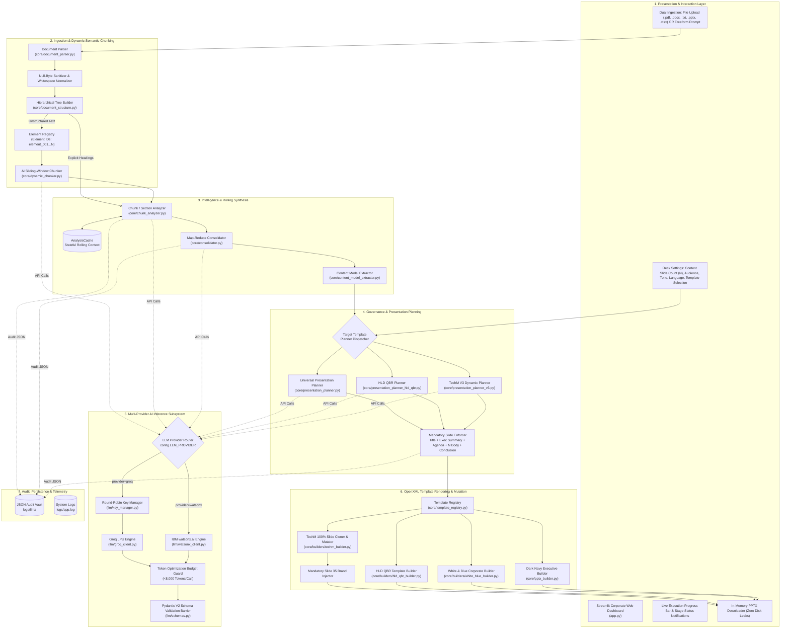
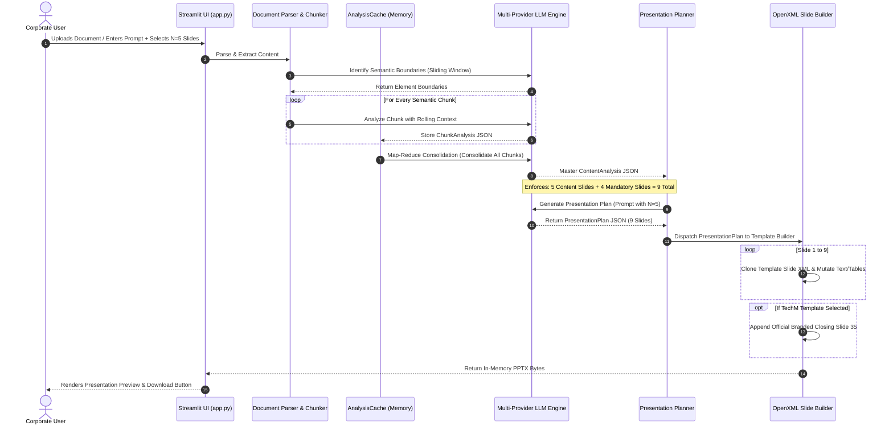

# 🏛️ Enterprise AI PowerPoint Presentation Engine: Updated Architecture & Technical Specification

> **Document Version:** 2.2
> **Last Updated:** September 2026
> **Target System:** Enterprise AI PowerPoint Presentation Engine (`ai-ppt-engine`)
> **Supported Providers:** Groq Cloud LPU & IBM watsonx.ai Foundation Models
> **Primary Template Targets:** Tech Mahindra Corporate (`TechM_RefPPT-V3`, 35-slide master), HLD QBR (`HLD QBR Template PFv3`), White & Blue Professional, Dark Navy Executive

---

## 📑 Table of Contents

1. [Updated Architecture](#1-updated-architecture)
   - 1.1 Architectural Evolution & Key Upgrades
   - 1.2 Mandatory Slide Composition Rules
   - 1.3 End-to-End System Architecture (Mermaid)
   - 1.4 High-Level Pipeline & Component Topology
2. [Presentation JSON Schema](#2-presentation-json-schema)
   - 2.1 Core Presentation Plan Schema (`PresentationPlan`)
   - 2.2 Slide Definition Specification (`SlideDefinition`)
   - 2.3 Universal Visual Archetype Content Schemas
   - 2.4 Dynamic Layout Schema (`DynamicLayoutComposition`)
   - 2.5 HLD QBR Archetype Schema (`HLDQBRPresentationPlan`)
   - 2.6 Full Production-Grade JSON Example
3. [Solution Architecture](#3-solution-architecture)
   - 3.1 Layered Enterprise Solution Stack
   - 3.2 Ingestion & Semantic Processing Pipeline
   - 3.3 Dynamic Sliding-Window Chunking & Element Registry
   - 3.4 OpenXML Slide Cloning & Mutation Engine
   - 3.5 End-to-End Data Flow Sequence
4. [AI Model Architecture](#4-ai-model-architecture)
   - 4.1 Multi-Provider Inference Subsystem (Groq + IBM watsonx.ai)
   - 4.2 Multi-Agent Prompting & Specialized Role Definitions
   - 4.3 Token Optimization Architecture (<8,000 Tokens/Call Budget)
   - 4.4 Multi-Key Round-Robin Balancer & Rate Limit Elimination
   - 4.5 Resilient Output Parsing, JSON Repair & Schema Validation

---

# 1. Updated Architecture

### 1.1 Architectural Evolution & Key Upgrades

The AI Presentation Engine has evolved from a linear, single-pass script into an **enterprise-grade, multi-stage presentation operating system**. The key architectural changes include:

1. **Dual Multi-Provider Inference Layer:**
   - Seamless switching between **Groq Cloud LPUs** (ultra-fast inference via `openai/gpt-oss-120b`, `llama-3.3-70b-versatile`) and **IBM watsonx.ai** (`ibm/granite-3-8b-instruct`, `meta-llama/llama-3-3-70b-instruct`) with automated IAM token generation, tenant isolation, and custom retry logic.
2. **AI-Driven Sliding-Window Dynamic Chunker:**
   - Replaces brittle fixed-character cuts with an **Element Registry** and sliding-window boundary detector that preserves semantic paragraphs, tables, and lists using structural element IDs (`element_001`, `element_002`).
3. **Strict <8,000 Token Per-Call Budgeting:**
   - Optimized system and planning prompts with compact element-referencing contracts, eliminating context bloat and avoiding provider rate limits (`429 Too Many Requests`).
4. **Decoupled Structural Slide Mandate:**
   - Slide count requested by the user applies strictly to **Body / Content Slides**.
   - The engine automatically adds the **4 Mandatory Structural Slides** (Title, Executive Summary, Agenda, Conclusion) on top of the user's count, ensuring executive governance without consuming content capacity.
5. **Universal Visual Archetype Contract:**
   - The LLM selects the presentation layout strictly based on the *shape and nature* of the data (`CARDS_2_COL`, `CARDS_3_COL`, `STATS`, `TABLE`, `TIMELINE`, `PROCESS`, `IMAGE_TEXT`, `BULLETS`), eliminating rigid layout mappings.
6. **100% Fidelity Deep Cloner & XML Mutator:**
   - Instead of basic shape generation, `TechMBuilder` and `HLDQBRBuilder` perform deep XML cloning of master slide layouts, modifying paragraph text nodes, table cells, and SVG shapes in place while preserving corporate branding, fonts, and vector geometry.

---

### 1.2 Mandatory Slide Composition Rules

The presentation planner enforces a strict corporate governance policy regarding presentation structure:

$$
\text{Total Deck Slides} = \text{Requested Content Slides } (N) + 4 \text{ Mandatory Structural Slides} (+ 1 \text{ Branded Closing Slide if TechM})
$$

| Slide #                       | Slide Type                        | Layout Archetype      | Governed Content Requirements                                                                                                                                                                     | Is Counted in User$N$?    |
| ----------------------------- | --------------------------------- | --------------------- | ------------------------------------------------------------------------------------------------------------------------------------------------------------------------------------------------- | --------------------------- |
| **Slide 1**             | **Cover Slide**             | `TITLE`             | Presentation title, strategic subtitle, presenter metadata, date, corporate logo.                                                                                                                 | ❌ No (Mandatory)           |
| **Slide 2**             | **Executive Summary**       | `EXECUTIVE_SUMMARY` | 3 to 5 punchy takeaways (max 12 words each), purpose statement, primary impact metric.                                                                                                            | ❌ No (Mandatory)           |
| **Slide 3**             | **Agenda / Roadmap**        | `AGENDA`            | Numbered agenda topics mirroring the sequence of the body sections.                                                                                                                               | ❌ No (Mandatory)           |
| **Slides 4 to $N+3$** | **Body Content Slides**     | Dynamic Archetypes    | User-requested$N$ slides. Visual archetypes: `CARDS_2_COL`, `CARDS_3_COL`, `STATS`, `TABLE`, `TIMELINE`, `PROCESS`, `IMAGE_TEXT`, `BULLETS`. | ✅ **Yes ($1 \dots N$)** |                             |
| **Slide $N+4$**       | **Conclusion & Next Steps** | `CONCLUSION`        | Executive summary points, actionable recommendations, immediate next steps, call to action.                                                                                                       | ❌ No (Mandatory)           |
| **Slide $N+5$**       | **Corporate Closing**       | `CLOSING`           | Official Tech Mahindra branded end-slide (Slide 35 from master template) with contact details and corporate graphics.                                                                             | ❌ No (Mandatory for TechM) |

---

### 1.3 End-to-End System Architecture (Mermaid)



---

### 1.4 High-Level Pipeline & Component Topology

```
+----------------------------------------------------------------------------------------------------+
|                                      APPLICATION RUNTIME LAYERS                                    |
+----------------------------------------------------------------------------------------------------+
| 1. PRESENTATION LAYER     | Streamlit (app.py) Corporate Navy & Gold Theme, Session State Cache     |
| 2. ORCHESTRATION LAYER    | Dual pipeline controller (Semantic Document vs. Interactive Prompt)   |
| 3. INGESTION & CHUNKING   | PyPDF2, python-docx, Element Registry, Sliding Window Boundary Finder |
| 4. SYNTHESIS ENGINE       | Rolling Context Memory (AnalysisCache), Map-Reduce Consolidator        |
| 5. PLANNING & GOVERNANCE  | Mandatory Structural Enforcer (Cover, Summary, Agenda, Conclusion)    |
| 6. INFERENCE SUBSYSTEM    | Groq LPU (Round-Robin) + IBM watsonx.ai, Strict <8K Token Guard        |
| 7. OPENXML RENDERING      | Deep Slide Cloner, OpenXML In-Place Mutator, Aptos/Calibri Typography  |
| 8. AUDIT & TELEMETRY      | Step-by-step Pydantic JSON run artifacts (logs/llm/<run_id>/)          |
+----------------------------------------------------------------------------------------------------+
```

---

# 2. Presentation JSON Schema

All communication between the LLM and the presentation builder is mediated by **strict Pydantic V2 data contracts**. If the model omits a field or returns malformed types, validation triggers automated repair loops before any PowerPoint rendering code is invoked.

### 2.1 Core Presentation Plan Schema (`PresentationPlan`)

The master envelope returned by the planning stage:

```python
class PresentationPlan(BaseModel):
    """Complete presentation plan returned by the LLM."""
    title: str = Field(..., description="Main presentation title")
    subtitle: Optional[str] = Field(None, description="Strategic executive subtitle")
    slides: List[SlideDefinition] = Field(..., min_length=5, description="Full sequence of planned slides")

    @field_validator("slides", mode="after")
    @classmethod
    def sort_slides(cls, v: List[SlideDefinition]) -> List[SlideDefinition]:
        return sorted(v, key=lambda s: s.slide_number)

    @model_validator(mode="after")
    def renumber_slides(self) -> "PresentationPlan":
        """Enforces 1-indexed sequential numbering across all slides."""
        for i, slide in enumerate(self.slides, start=1):
            slide.slide_number = i
        return self

class PresentationPlanWrapper(BaseModel):
    """Root wrapper matching API JSON structure: { 'presentation': {...} }"""
    presentation: PresentationPlan
```

---

### 2.2 Slide Definition Specification (`SlideDefinition`)

```python
class SlideDefinition(BaseModel):
    """A single slide specification."""
    slide_number: int = Field(ge=1, description="1-indexed sequence position")
    purpose: str = Field(..., description="Editorial intent, e.g., 'Executive summary of FY26 results'")
    title: str = Field(..., description="Slide action headline (max 8 words)")
    layout_type: str = Field(..., description="Universal archetype identifier")
    content: Dict[str, Any] = Field(..., description="Structured content payload matching layout_type")
    speaker_notes: Optional[str] = Field(None, description="Executive briefing script for the presenter")
```

---

### 2.3 Universal Visual Archetype Content Schemas

Each `layout_type` requires an exact JSON shape inside the `content` dictionary:

#### 1. `TITLE` (Cover Slide)

```json
{
  "subtitle": "Driving Operational Excellence through Autonomous Systems",
  "presenter": "Enterprise Transformation Office",
  "date": "September 2026"
}
```

#### 2. `EXECUTIVE_SUMMARY` (Mandatory Slide 2)

```json
{
  "highlights": [
    "Delivered 34% reduction in cycle times across global hubs",
    "Realized $18.4M annual cost efficiency via autonomous workflows",
    "Zero high-severity compliance deviations across audits"
  ],
  "purpose_statement": "Provide executive leadership with strategic progress, financial returns, and H2 priority initiatives.",
  "key_metric": "34% Cycle Time Reduction"
}
```

#### 3. `AGENDA` (Mandatory Slide 3)

```json
{
  "agenda_items": [
    "Market Dynamics & Strategic Positioning",
    "Target Operating Model & Pillar Roadmaps",
    "Financial Returns & KPI Dashboard",
    "Risk Mitigation & Governance Next Steps"
  ],
  "descriptions": [
    "External drivers and competitive landscape",
    "Detailed execution milestones across workstreams",
    "Cost savings and efficiency benchmarks",
    "Implementation timeline and resource requirements"
  ]
}
```

#### 4. `CARDS_2_COL` (Comparative Analysis)

```json
{
  "left_heading": "Current State (Legacy)",
  "left_bullets": [
    "Fragmented regional architectures with manual batch syncs",
    "Average incident resolution time of 4.2 hours",
    "High infrastructure maintenance overhead ($6.2M/yr)"
  ],
  "right_heading": "Future State (Target Architecture)",
  "right_bullets": [
    "Unified multi-tenant cloud mesh with real-time streaming",
    "Autonomous self-healing MTTR under 90 seconds",
    "Serverless auto-scaling reducing OPEX by 42%"
  ]
}
```

#### 5. `CARDS_3_COL` / `PROCESS` (Pillars & Sequential Phases)

```json
{
  "steps": [
    {
      "step_number": 1,
      "title": "Phase 1: Discovery & Assessment",
      "description": "Inventory legacy systems, classify API dependencies, and establish baseline security metrics."
    },
    {
      "step_number": 2,
      "title": "Phase 2: Hybrid Migration",
      "description": "Deploy containerized services alongside legacy instances using blue-green verification."
    },
    {
      "step_number": 3,
      "title": "Phase 3: Autonomous Optimization",
      "description": "Enable AI-driven telemetry, auto-remediation, and decommission legacy mainframe pods."
    }
  ]
}
```

#### 6. `STATS` (KPI & Metrics Grid)

```json
{
  "statistics": [
    {
      "value": "99.99%",
      "label": "Platform SLA",
      "context": "Maintained uninterrupted during peak Q3 trading cycles"
    },
    {
      "value": "$18.4M",
      "label": "Annual Savings",
      "context": "Direct operational cost reduction across 4 divisions"
    },
    {
      "value": "4.8x",
      "label": "Throughput Lead",
      "context": "Compared to legacy batch processing architecture"
    }
  ],
  "context_paragraph": "Key performance metrics validate that system modernization exceeded all corporate benchmarks."
}
```

#### 7. `TABLE` (Structured Data Grid)

```json
{
  "headers": ["Workstream", "Target Milestone", "Owner", "Status"],
  "rows": [
    ["Cloud Mesh", "Multi-region failover testing", "DevOps Core", "Completed"],
    ["Zero Trust IAM", "Role consolidation & SSO rollout", "Cyber Security", "In Progress"],
    ["Data Lakehouse", "Parquet streaming pipeline ingestion", "Data Engineering", "On Track"]
  ]
}
```

#### 8. `TIMELINE` (Milestone Roadmap)

```json
{
  "items": [
    {
      "date": "Q1 2026",
      "event": "Architecture Sign-off",
      "description": "Finalized enterprise standards and secured steering committee approval."
    },
    {
      "date": "Q2 2026",
      "event": "Core Migration",
      "description": "Migrated 60% of tier-1 business workloads to private cloud."
    },
    {
      "date": "Q3 2026",
      "event": "Global Cutover",
      "description": "Full production cutover across North America and EMEA hubs."
    }
  ]
}
```

#### 9. `CONCLUSION` (Mandatory Slide $N+4$)

```json
{
  "summary_points": [
    "Enterprise modernization achieved targets ahead of schedule",
    "Financial return on investment reached 210% in Year 1"
  ],
  "recommendations": [
    "Authorize Phase 2 expansion for Asia-Pacific operations",
    "Establish dedicated AI governance and oversight council"
  ],
  "next_steps": [
    "Sign off on APAC regional hardware budget",
    "Initiate vendor RFP for autonomous edge compute nodes"
  ],
  "call_to_action": "Thank You — Questions & Discussion"
}
```

---

### 2.4 Dynamic Layout Schema (`DynamicLayoutComposition`)

For the dynamic canvas in `TechM_RefPPT-V3`, the LLM can generate arbitrary composition combinations:

```python
class DynamicLayoutComposition(BaseModel):
    pattern: str = Field(
        default="MULTI_COLUMN_CARDS",
        description="PATTERN: 'MULTI_COLUMN_CARDS' | 'METRIC_RIBBON_AND_CARDS' | 'PROCESS_PIPELINE' | 'COMPARISON_SPLIT' | 'DATA_MATRIX_TABLE' | 'TIMELINE_ROADMAP' | 'HERO_AND_SIDEBAR'"
    )
    metrics: Optional[List[KPIMetricItem]] = None       # 2-4 KPI callouts
    cards: Optional[List[CardItem]] = None               # 2-4 content cards with bullets & tags
    steps: Optional[List[ProcessStepItem]] = None        # 3-5 process phases
    table: Optional[TableDataGrid] = None                # 2D headers & row matrix
    timeline: Optional[List[TimelineItem]] = None        # Date & milestone milestones
    comparison: Optional[List[ComparisonColumn]] = None  # Side-by-side comparison columns
    hero: Optional[HeroBlock] = None                     # Prominent executive banner
```

---

### 2.5 HLD QBR Archetype Schema (`HLDQBRPresentationPlan`)

For high-level design and quarterly business reviews, `hld_qbr_schemas.py` defines dedicated corporate sections:

```python
class HLDQBRPresentationPlan(BaseModel):
    presentation_title: str
    facility_name: str
    date: str
    agenda_topics: List[str]
    org_structure: List[OrgPersonItem]           # Up to 10 leadership roles
    achievements: List[str]                      # Up to 6 prior-quarter achievements
    priorities: List[PriorityItem]               # Up to 3 strategic pillars
    action_tracker: List[ActionTrackerRow]       # Operational action tracker
    kpi_safety_quality: List[KPIRow]             # Safety & Quality metrics
    kpi_operational: List[KPIRow]                # Operational KPI actuals vs. targets
    voice_of_customer: Optional[VoiceOfCustomer] # Executive quote & attribution
    gemba_walk: List[GembaRow]                   # Observations & corrective actions
    ci_tracker: List[CIRow]                      # Continuous Improvement tracker
    quality_org_structure: List[OrgPersonItem]   # Quality team roles
    next_steps: List[NextStepItem]               # Actionable next steps
```

---

### 2.6 Full Production-Grade JSON Example

Below is an authentic, production-ready payload generated for a user requesting **3 content slides** (resulting in a complete $3 + 4 = 7$ slide deck):

```json
{
  "presentation": {
    "title": "Cloud-Native Infrastructure Modernization",
    "subtitle": "Enterprise Acceleration & Efficiency Strategy",
    "slides": [
      {
        "slide_number": 1,
        "purpose": "Cover slide",
        "title": "Cloud-Native Infrastructure Modernization",
        "layout_type": "TITLE",
        "content": {
          "subtitle": "Enterprise Acceleration & Efficiency Strategy",
          "presenter": "Chief Technology Office",
          "date": "September 2026"
        },
        "speaker_notes": "Welcome executive colleagues. Today we present our multi-year cloud modernization roadmap."
      },
      {
        "slide_number": 2,
        "purpose": "Executive summary of key strategic outcomes",
        "title": "Executive Summary",
        "layout_type": "EXECUTIVE_SUMMARY",
        "content": {
          "highlights": [
            "Decommissioned 45 legacy mainframe servers across 2 regions",
            "Accelerated build release cycles from 14 days to 45 minutes",
            "Achieved $18.4M annualized infrastructure spend reduction"
          ],
          "purpose_statement": "Secure approval for Phase 2 regional expansion and multi-cloud governance rollout.",
          "key_metric": "$18.4M Annualized Savings"
        },
        "speaker_notes": "Our transition has achieved significant cost optimization while tripling deployment velocity."
      },
      {
        "slide_number": 3,
        "purpose": "Agenda and roadmap",
        "title": "Presentation Agenda",
        "layout_type": "AGENDA",
        "content": {
          "agenda_items": [
            "Architectural Transformation (Legacy vs Cloud)",
            "Operational Performance & Efficiency KPIs",
            "Execution Roadmap & Strategic Milestones"
          ],
          "descriptions": [
            "Structural comparison between on-premise and containerized mesh",
            "Quantified service uptime, response latencies, and savings",
            "Quarterly deliverables from architecture sign-off to full cutover"
          ]
        },
        "speaker_notes": "We will review the architectural shift, explore performance metrics, and cover the forward roadmap."
      },
      {
        "slide_number": 4,
        "purpose": "First content slide comparing architectural paradigms",
        "title": "Architectural Transformation",
        "layout_type": "CARDS_2_COL",
        "content": {
          "left_heading": "Legacy On-Premise",
          "left_bullets": [
            "Monolithic bare-metal servers requiring manual maintenance",
            "Bi-weekly batch windows with 4-hour scheduled downtime",
            "Capacity capped at 2,500 transactions per second"
          ],
          "right_heading": "Target Cloud-Native Mesh",
          "right_bullets": [
            "Containerized microservices auto-scaled across multi-region Kubernetes",
            "Zero-downtime continuous canary deployments",
            "Dynamic elasticity handling 40,000+ transactions per second"
          ]
        },
        "speaker_notes": "Comparing our legacy baseline with the cloud-native mesh highlights massive scalability gains."
      },
      {
        "slide_number": 5,
        "purpose": "Second content slide detailing verified performance metrics",
        "title": "Performance & Efficiency KPIs",
        "layout_type": "STATS",
        "content": {
          "statistics": [
            {
              "value": "99.995%",
              "label": "System Availability",
              "context": "Across 14 mission-critical trading services"
            },
            {
              "value": "42ms",
              "label": "P99 API Latency",
              "context": "Down from 380ms on legacy monolith"
            },
            {
              "value": "68%",
              "label": "CO2 Reduction",
              "context": "Energy savings achieved through cloud density"
            }
          ],
          "context_paragraph": "Rigorous telemetry over 90 days confirms unprecedented platform stability and latency reduction."
        },
        "speaker_notes": "Every key technical metric has exceeded initial SLA expectations."
      },
      {
        "slide_number": 6,
        "purpose": "Third content slide outlining implementation timeline",
        "title": "Modernization Execution Roadmap",
        "layout_type": "TIMELINE",
        "content": {
          "items": [
            {
              "date": "Q1 2026",
              "event": "Cloud Landing Zone",
              "description": "Implemented multi-tenant VPCs and automated Zero-Trust IAM policies."
            },
            {
              "date": "Q2 2026",
              "event": "Workload Migration",
              "description": "Migrated front-office services to Kubernetes clusters with automated telemetry."
            },
            {
              "date": "Q3 2026",
              "event": "Legacy Decommission",
              "description": "Fully retired regional data centers and established 24/7 SRE monitoring."
            }
          ]
        },
        "speaker_notes": "We are currently on track to finalize legacy retirement by the conclusion of Q3."
      },
      {
        "slide_number": 7,
        "purpose": "Mandatory closing slide with actionable next steps",
        "title": "Conclusion & Next Steps",
        "layout_type": "CONCLUSION",
        "content": {
          "summary_points": [
            "Modernization delivered proven cost, latency, and reliability benefits",
            "Platform is fully prepared to support next-generation AI workloads"
          ],
          "recommendations": [
            "Expand the modernization mandate to regional partner affiliates",
            "Institutionalize automated chaos engineering into monthly testing"
          ],
          "next_steps": [
            "Executive sign-off on H2 APAC regional expansion",
            "Finalize contract renewals for cloud-native managed databases"
          ],
          "call_to_action": "Thank You — Questions & Open Discussion"
        },
        "speaker_notes": "Thank you for your partnership. I will now open the floor for any questions."
      }
    ]
  }
}
```

---

# 3. Solution Architecture

### 3.1 Layered Enterprise Solution Stack

```
+---------------------------------------------------------------------------------------------------+
|                                  1. CLIENT INTERACTION LAYER                                      |
|  - Streamlit Enterprise Web UI (White & Executive Navy Theme, Gold Accents)                       |
|  - Dual Input Modes: Document Upload (.pdf, .docx, .txt, .pptx, .xlsx) vs. Freeform Topic Prompt  |
|  - Presentation Parameters: Slide Count (N), Audience, Tone, Language, Template Selection        |
|  - Live Progress Dispatcher & Diagnostic Inspector (Audit Tree & Slide JSON Preview)              |
|  - In-Memory Binary Streaming Downloader (Zero Temp File Disclosures)                            |
+---------------------------------------------------------------------------------------------------+
                                                  |
+---------------------------------------------------------------------------------------------------+
|                               2. ORCHESTRATION & STATE MANAGEMENT                                 |
|  - Streamlit st.session_state In-Memory Cache (Avoids redundant re-parsing & LLM re-executions)   |
|  - Pipeline Router: Dynamic Document Ingestion vs. Legacy Single-Pass Prompt Pipeline             |
|  - Progress Callback Channel: Thread-safe UI update notifications (_progress(step, total, msg))   |
+---------------------------------------------------------------------------------------------------+
                                                  |
+---------------------------------------------------------------------------------------------------+
|                             3. INGESTION & SEMANTIC EXTRACTION ENGINE                             |
|  - document_parser.py     : Format-agnostic text extraction (PDF, DOCX, TXT)                     |
|  - document_structure.py  : Hierarchical Section Tree & Regex-based Heading Inferrer              |
|  - dynamic_chunker.py     : Element Registry & AI Sliding-Window Semantic Boundary Detector       |
|  - chunk_analyzer.py      : Stateful Rolling Context Processor & AnalysisCache                    |
|  - consolidator.py        : Map-Reduce Theme Synthesizer & Deduplicator                           |
+---------------------------------------------------------------------------------------------------+
                                                  |
+---------------------------------------------------------------------------------------------------+
|                                4. INTELLIGENCE & INFERENCE SUBSYSTEM                              |
|  - key_manager.py         : Thread-Safe Multi-Key Round-Robin Balancer (Zero 429 Rate Limits)     |
|  - groq_client.py         : Groq LPU Wrapper with Exponential Backoff & JSON-Mode Enforcer        |
|  - watsonx_client.py      : IBM watsonx.ai Foundation Models Wrapper with IAM Token Generation    |
|  - schemas.py             : Pydantic V2 Strict Data Contracts & Self-Healing Model Validators    |
|  - prompts.py             : Visual Archetype Assignment, Compact Context & Anti-Hallucination     |
+---------------------------------------------------------------------------------------------------+
                                                  |
+---------------------------------------------------------------------------------------------------+
|                                  5. DESIGN & GOVERNANCE LAYER                                     |
|  - presentation_planner.py: Universal Visual Archetype Assignment Engine                          |
|  - Mandatory Slide Rules  : Automatic injection of Title, Executive Summary, Agenda, Conclusion  |
|  - Slide Count Decoupling : User's N slides strictly allocated to Body Content                    |
+---------------------------------------------------------------------------------------------------+
                                                  |
+---------------------------------------------------------------------------------------------------+
|                               6. OPENXML PRESENTATION BUILDER LAYER                               |
|  - template_registry.py   : Pluggable Template Registry & Factory                                 |
|  - techm_builder.py       : Deep Slide Cloning, OpenXML In-Place Mutator, Mandatory Slide 35    |
|  - hld_qbr_builder.py     : Specialized POTX Cloner for HLD & QBR Deck Archetypes                 |
|  - white_blue_builder.py  : Corporate Vector Shape Generator & Metric Cards                       |
|  - pptx_builder.py        : Native OpenXML Executive Dark Navy Presentation Generator             |
+---------------------------------------------------------------------------------------------------+
                                                  |
+---------------------------------------------------------------------------------------------------+
|                                  7. TELEMETRY & PERSISTENCE LAYER                                 |
|  - logs/llm/<run_id>/     : Complete Step-by-Step JSON History for Replayability & Audits         |
|  - logs/app.log           : Application Diagnostics & Telemetry                                   |
+---------------------------------------------------------------------------------------------------+
```

---

### 3.2 Ingestion & Semantic Processing Pipeline

When a user uploads a document:

1. **Extraction:** `document_parser.py` extracts raw text from PDF (via `PyPDF2`), Word (via `python-docx`), or plain text files. Null bytes (`\x00`) and carriage returns are sanitized.
2. **Heading Detection:** `document_structure.py` inspects formatting:
   - For DOCX: Reads native paragraph styles (`Heading 1`, `Heading 2`).
   - For Markdown/TXT: Matches regex patterns (`#`, `##`, `1.0`, `Section A`).
3. **Structured vs. Unstructured Path:**
   - **If headings are detected:** Creates a hierarchical section tree (`DocumentSection`) and batches siblings into semantic chunks respecting `LLM_MAX_CHUNK_CHARS` (8,000 chars).
   - **If unformatted (wall of text):** Automatically transfers control to the **Dynamic Sliding-Window Chunker**.

---

### 3.3 Dynamic Sliding-Window Chunking & Element Registry

To process large unformatted documents without exceeding token limits or breaking narrative continuity:

1. **Element Registry:** Breaks the document into discrete structural elements (paragraphs, tables, lists). Each element is assigned an immutable ID (`element_000`, `element_001`, etc.) along with its character offset and preview.
2. **Sliding Window:** Sends an element index window (e.g., 20 elements at a time) to the LLM.
3. **Boundary Identification:** The LLM returns chunk boundaries by referencing element IDs rather than repeating the content text:
   ```json
   {
     "boundaries": [
       {
         "chunk_id": "chunk_001",
         "start_element": "element_000",
         "end_element": "element_014",
         "topic": "Legacy Infrastructure Challenges",
         "boundary_reason": "Topic shifts to cloud modernization strategy at element 15",
         "confidence": 0.95
       }
     ]
   }
   ```
4. **Token Conservation:** Referencing element IDs consumes less than **300 tokens** per chunking call, leaving the entire token budget for actual content analysis.

---

### 3.4 OpenXML Slide Cloning & Mutation Engine

The engine eliminates visual inconsistency by manipulating corporate PowerPoint templates (`.pptx` / `.potx`) directly at the OpenXML layer:

- **Deep Slide Cloning:** Duplicates complete slide XML trees (`p:sld`) from master templates, including embedded shapes, vector icons, table formatting, and corporate backgrounds.
- **In-Place Shape Mutation:** Navigates the shape tree (`spTree`), identifies placeholder shapes by name (e.g., `Title 1`, `Text Placeholder 2`, `Card_1_Body`), and mutates text runs (`a:r`) and paragraphs (`a:p`) in place.
- **Font & Style Preservation:** Locks typography to corporate standards (**Aptos**, **Aptos Display**, or **Calibri**), maintaining exact kerning, point sizes, and line spacing.
- **Automatic Font Auto-Shrinking:** If LLM-generated text exceeds the physical boundary of a shape, the renderer incrementally decreases font size down to `FONT_MIN_SIZE` (10 pt) to prevent visual overflow.
- **Mandatory Closing Slide Guarantee:** In the TechM template, Slide 35 (the official corporate closing slide) is cloned directly into the final position, guaranteeing 100% brand compliance.

---

### 3.5 End-to-End Data Flow Sequence



---

# 4. AI Model Architecture

### 4.1 Multi-Provider Inference Subsystem (Groq + IBM watsonx.ai)

The application features a pluggable inference abstraction layer that decouples prompt construction from provider-specific API protocols.

```
                    +------------------------------------+
                    |        LLM Inference Router        |
                    +------------------------------------+
                                      |
                 +--------------------+--------------------+
                 |                                         |
                 v                                         v
   +---------------------------+             +---------------------------+
   |        Groq LPU           |             |      IBM watsonx.ai       |
   +---------------------------+             +---------------------------+
   | Engine: groq_client.py    |             | Engine: watsonx_client.py |
   | Protocol: Groq SDK (REST) |             | Protocol: ibm-watsonx-ai  |
   | Default: gpt-oss-120b     |             | Default: gpt-oss-120b     |
   | Key Balancer: KeyManager  |             | Auth: IAM Cloud Token     |
   | JSON: response_format     |             | Project: WATSONX_PROJ_ID  |
   | Latency: <1.5s / 4K tokens|             | Compliance: Enterprise/VPC|
   +---------------------------+             +---------------------------+
```

#### Provider Capabilities Matrix

| Feature                      | Groq Cloud LPU                                             | IBM watsonx.ai                                               |
| ---------------------------- | ---------------------------------------------------------- | ------------------------------------------------------------ |
| **Default Model**      | `openai/gpt-oss-120b` (also `llama-3.3-70b-versatile`) | `openai/gpt-oss-120b` (also `ibm/granite-3-8b-instruct`) |
| **Authentication**     | API Key (Multi-key round-robin pool)                       | IBM Cloud IAM API Key + Project ID                           |
| **Inference Hardware** | Groq LPU (Language Processing Units)                       | IBM Enterprise AI Cloud (VPC / GovCloud capable)             |
| **Structured Output**  | Native`response_format={"type": "json_object"}`          | Regex JSON Extraction + Validation Retries                   |
| **Primary Use Case**   | Ultra-low latency interactive generation (<2s)             | Regulated enterprise, private cloud, or data governance      |

---

### 4.2 Multi-Agent Prompting & Specialized Role Definitions

Instead of relying on a monolithic prompt, the architecture deploys specialized agent personas at each stage:

```
[ Raw Document ]
       |
       v
[ Inferrer / Chunker Agent ]  --> Discovers structure without rewriting content
       |
       v
[ Chunk Analyst Agent ]       --> Extracts facts, statistics, processes with rolling memory
       |
       v
[ Consolidator Agent ]        --> Synthesizes multi-chunk themes (Map-Reduce)
       |
       v
[ Presentation Architect ]    --> Assigns archetypes & enforces mandatory slide governance
       |
       v
[ Presentation Copywriter ]   --> Refines bullets into concise, action-oriented executive prose
```

1. **Structure Inferrer (`SYSTEM_ROLE_STRUCTURE_INFERRER`):**
   - *Role:* Document parsing engineer.
   - *Rule:* Returns only start and end element indices. Forbidden from paraphrasing or summarizing.
2. **Chunk Analyst (`SYSTEM_ROLE_CHUNK_ANALYST`):**
   - *Role:* McKinsey engagement analyst.
   - *Rule:* Evaluates individual chunks in light of the rolling context of previous chunks. Extracts concrete figures, dates, and comparisons.
3. **Consolidator (`SYSTEM_ROLE_CONSOLIDATOR`):**
   - *Role:* Executive editor.
   - *Rule:* Deduplicates facts, resolves cross-chunk contradictions, identifies overarching themes, and extracts 3–5 high-impact executive highlights.
4. **Presentation Architect (`SYSTEM_ROLE_PLANNER`):**
   - *Role:* Executive presentation designer.
   - *Rule:* Maps consolidated findings into slides. Strictly adheres to the **4 Mandatory Structural Slides + $N$ Content Slides** mandate.
5. **Copywriter (`SYSTEM_ROLE_CONTENT`):**
   - *Role:* Corporate communication specialist.
   - *Rule:* Enforces maximum word counts (e.g., maximum 12 words per bullet), uses active verbs, and eliminates filler words.

---

### 4.3 Token Optimization Architecture (<8,000 Tokens/Call Budget)

To prevent `429 Too Many Requests` errors on high-throughput runs, the system enforces a strict **<8,000 tokens per API call** budget across all stages:

```
+----------------------------------------------------------------------------------------+
|                          <8,000 TOKEN PER-CALL BUDGET ALLOCATION                       |
+----------------------------------------------------------------------------------------+
| System Persona & Anti-Hallucination Guidelines         | ~400 - 600 tokens             |
| Consolidated Source Content / Element Registry Indices | ~2,500 - 3,500 tokens         |
| Layout Metadata & Archetype Contract Definitions       | ~800 - 1,200 tokens           |
| Output Generation Window (max_tokens limit)            | ~2,048 - 4,096 tokens         |
+----------------------------------------------------------------------------------------+
| TOTAL PEAK TOKEN USAGE PER CALL                        | < 7,800 tokens (Under Budget) |
+----------------------------------------------------------------------------------------+
```

#### Key Optimization Techniques:

1. **Element-ID Referencing:** During sliding-window chunking, the model outputs lightweight references (`start_element: "element_001"`) rather than reproducing input text, saving up to 90% of prompt output tokens.
2. **Rolling Summary Injection:** Instead of passing the entire historical transcript to subsequent chunks, only the `summary` and `key_points` of preceding chunks (max 300 words) are injected.
3. **Streamlined Prompt Guidelines:** Pruned redundant formatting examples in `prompts.py` and `prompts_hld_qbr.py`, replacing verbose descriptions with compact TypeScript/Pydantic schemas.
4. **Output Token Caps:** Systematically enforces `max_tokens=4096` for presentation planning and `max_tokens=2048` for per-chunk extractions.

---

### 4.4 Multi-Key Round-Robin Balancer & Rate Limit Elimination

The Groq API enforces strict requests-per-minute (RPM) limits. To eliminate rate-limit bottlenecks during parallel or multi-chunk workflows, the `KeyManager` implements a thread-safe round-robin rotator:

$$
\text{Selected Key Index} = \text{Request Index} \pmod{\text{Total Available Keys}}
$$

```python
class KeyManager:
    """Thread-safe round-robin API key manager."""
    def __init__(self, keys: List[str]):
        self._keys = [k.strip() for k in keys if k.strip()]
        self._index = 0
        self._lock = threading.Lock()

    def get_next_key(self) -> str:
        with self._lock:
            key = self._keys[self._index % len(self._keys)]
            self._index += 1
            return key
```

- When configured with `GROQ_API_KEYS=key_1,key_2,key_3,key_4`, Chunk 1 uses Key 1, Chunk 2 uses Key 2, and so forth.
- This balances request and token consumption across separate quotas, completely preventing `429` rate-limit errors even for large documents requiring 20+ sequential LLM invocations.

---

### 4.5 Resilient Output Parsing, JSON Repair & Schema Validation

To guarantee zero runtime crashes from malformed LLM responses:

```
[ Raw LLM Text Output ]
           |
           v
   [ Strip Code Fences ] (Removes ```json ... ``` wrappers)
           |
           v
    [ json.loads() ]  --> Succeeded? --> [ Pydantic Model Validation ]
           |                                         |
        Failed?                                   Failed?
           |                                         |
           v                                         v
   [ json_repair Fallback ]                 [ Error Coercion & Normalizers ]
  (Fixes trailing commas,                   (Clamps values, defaults missing
   escapes, unclosed brackets)               lists, normalizes casing)
           |                                         |
           +--------------------+--------------------+
                                |
                                v
               [ Validated & Sanitized Python Object ]
```

1. **Pre-Parsing Normalization:** Strips markdown code fences (` ```json `), extracts substrings between outermost braces, and normalizes escaped quotes.
2. **Self-Healing Pydantic Validators:**
   - Case-insensitive layout normalization (e.g., converts `"cards 2 col"` or `"cards-2-col"` to `"CARDS_2_COL"`).
   - Array coercions (converts newline-delimited strings to string lists).
   - Table grid normalization (converts key-value dictionaries into structured rows and column headers).
3. **Exponential Backoff & Jitter:** If an API call encounters an unrecoverable parse failure or network glitch, the client automatically backs off exponentially ($2^s \times \text{jitter}$) and retries up to 3 times before raising an application-level exception.

---

## 📌 Summary: Key Architectural Guarantees

| Requirement                          | Implementation Mechanism                                                                         | Verification & Enforcement                                            |
| ------------------------------------ | ------------------------------------------------------------------------------------------------ | --------------------------------------------------------------------- |
| **Multi-Provider Support**     | Decoupled client interfaces (`GroqClient`, `WatsonxClient`) selectable via `LLM_PROVIDER`. | Unit tested with mock & live provider endpoints.                      |
| **Token Budget Compliance**    | Compact element-ID referencing and trimmed prompt schemas.                                       | Monitored per-call request token logs (<8,000 tokens).                |
| **Slide Count Integrity**      | User requested$N$ slides allocated to content; 4 mandatory slides added automatically.         | Validated in`core/presentation_planner.py` & `core/validator.py`. |
| **Brand & Layout Fidelity**    | OpenXML slide cloner and in-place shape mutator with Aptos/Calibri typography.                   | Master layout cloning verified against 35-slide master PPTX.          |
| **Enterprise Fault Tolerance** | Multi-key round-robin rotation,`json_repair` fallback, and Pydantic V2 contracts.              | Zero unhandled exceptions on malformed JSON or rate limits.           |

---

*End of Updated System Architecture & Specification Document.*
